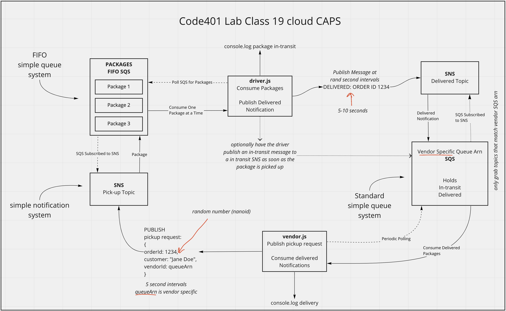
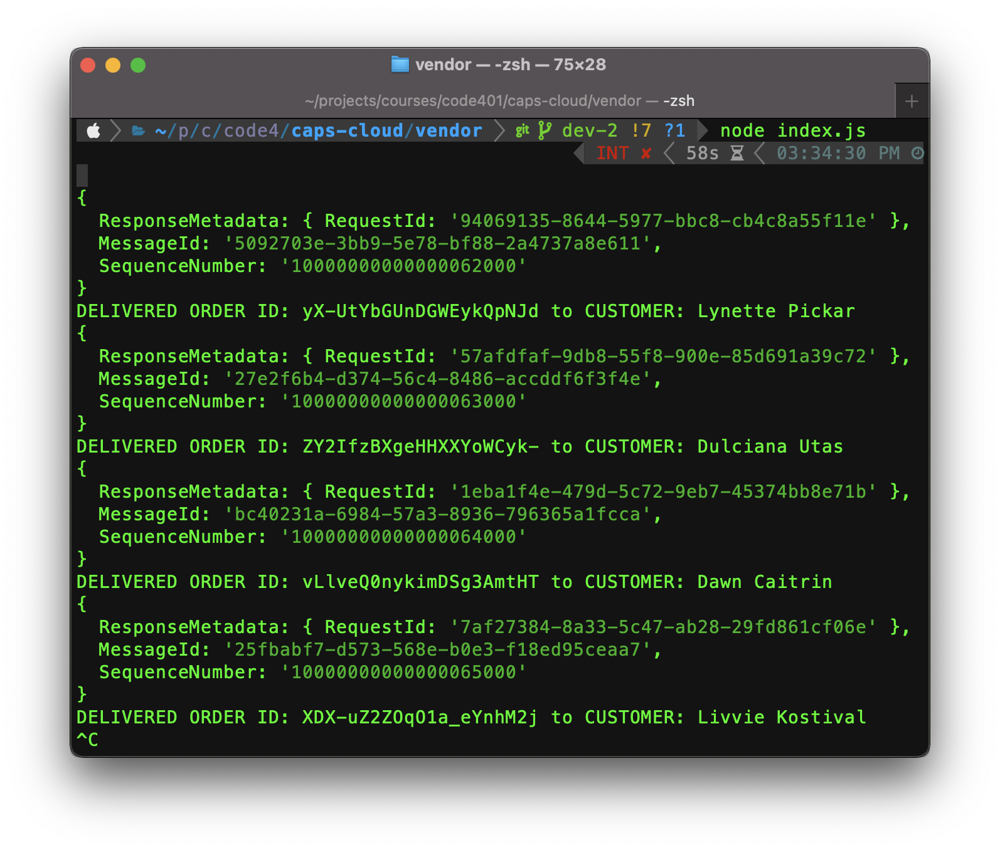
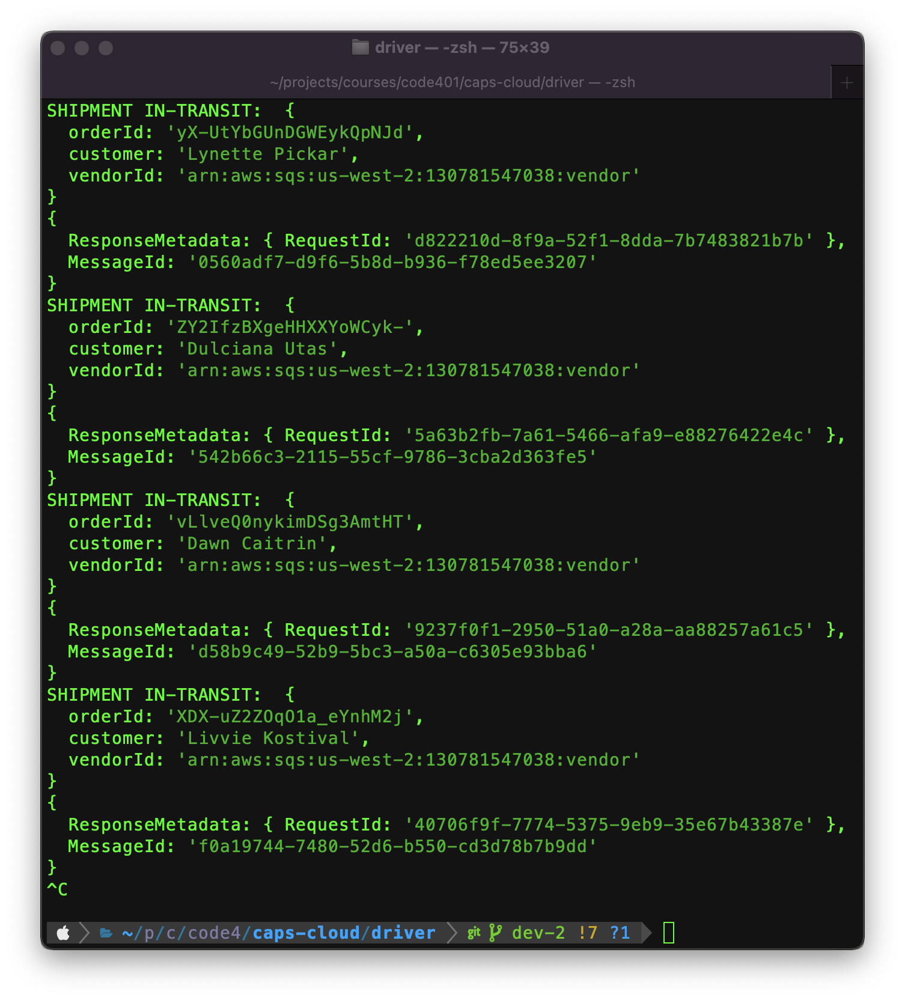

# caps-cloud

## About The Project
Build a serverless event driven CAPS system using only AWS Services: SQS, SNS, and Lambda. The CAPS system (Code Academy Parcel Service) mimics a real-time delivery service that allows for vendors to a alert a system of a package needing to be delivered, and for drivers to instantly see what is in their pick-up queue. Drivers can then in-turn alert vendors of the state of their packaages (in-transit, delivered).

## Built With

### Languages/Frameworks/Services
- AWS Simple Queue Service
- AWS Simple Notification Service
- Node.js

### npm Packages
- aws-sdk
- sqs-consumer
- nanoid
- random-name

## Getting Started

### Installation

1. Clone the repo
   ```sh
   git clone git@github.com:eriksavage/caps-cloud.git
   ```
2. Move into project directory
   ```sh
   cd caps-cloud/vendor
   ```
3. Install NPM packages
   ```sh
   npm install
   ```
4. Repeat for driver directory

## Usage

This project can be used as a starting block to build and understand serverless event driving applications. In it's current state there is not practical use.

## Function

### UML



### Package Flow

The vendor index.js file and driver index.js file both operate in node from the console to publish and consume messages per the UML cycle above.


### Vendor index.js



- vendor index.js file is called in the console
- using a set interval (10 seconds) a shipment object is generated
- shipment object is published to the pickup SNS (simple notification system) topic and console logged
- packages.fifo SQS (simple queue system) is subscribed to the pickup SNS and stores the shipment sent

--- return to steps below after driver steps ---
- vendor index.js polls vendor SQS, consuming all delivery notifications available
- vendor index.js console logs confirmed delivery

### Driver index.js



- driver index.js file is called in the console
- driver index.js file begins polling the packages.fifo FIFO queue, pulling one shipment at a time
- driver index.js console logs that the shipment has been picked up and is in-transit
- driver index.js publishes at a random interval (5 - 10 seconds) a Delivered message to the delivered SNS topic and is console logged
- vendor SQS subscribes to the delivered SNS and stores the delivered messages

--- return to vendor steps ---

## License

Distributed under the MIT License. See `LICENSE.txt` for more information.

## Contact

Developed by Erik Savage, [Github](https://github.com/eriksavage), [LinkedIn](https://www.linkedin.com/in/erikksavage/)


## Acknowlegments
- Kellen Linse, [Github](https://github.com/Kellen-Linse)
- Readme Template, [Github Repo](https://github.com/othneildrew/Best-README-Template)